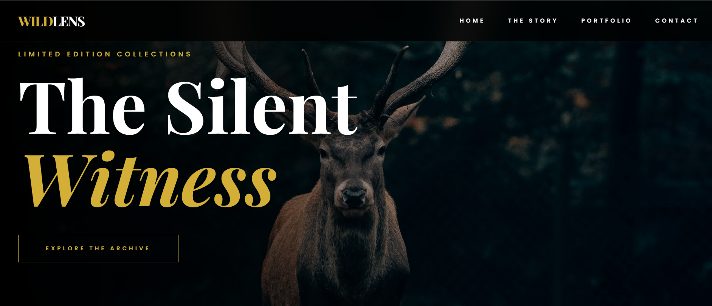
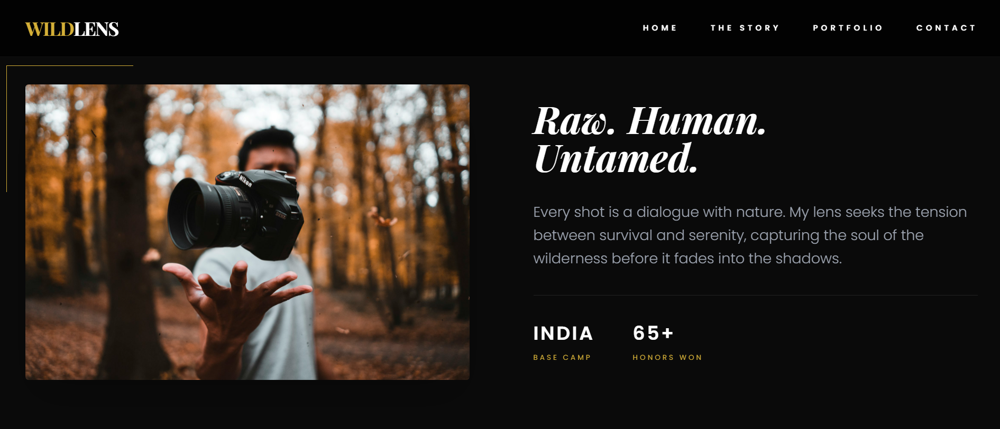
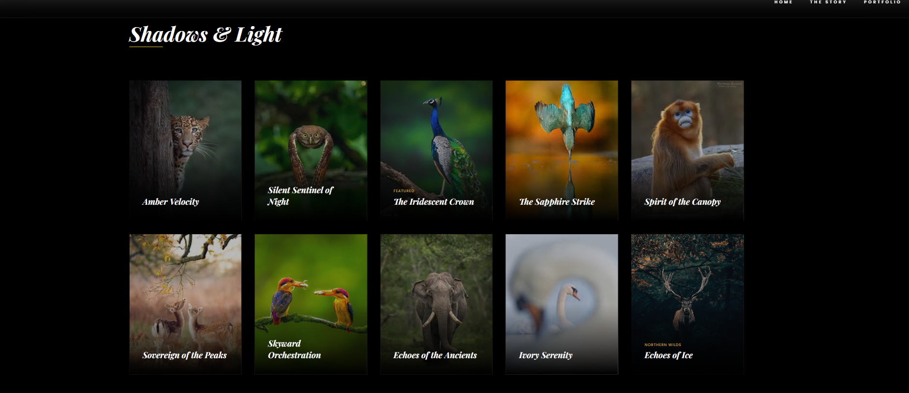

# 🌿 Wildlife Photography Website
A responsive front-end website designed to showcase wildlife photography through an immersive and visually engaging layout.  
This project focuses on clean UI design, structured layout, and responsive web development principles.

## 📌 Project Overview
This website was developed to practice and strengthen front-end development skills by building a real-world styled photography portfolio layout.

The project emphasizes:
- Structured HTML layout
- Modern CSS styling techniques
- Responsive design implementation
- Smooth background slideshow effects
- Organized project architecture

## 🚀 Features
- Full-screen hero section with background slideshow
- Clean and minimal UI design
- Responsive layout for all screen sizes
- Organized image gallery
- Smooth transitions and hover effects
- Structured folder architecture

## 🖼️ Screenshots

### 🌄 Hero Section

### 📱 About Section

### 🐾 Gallery Section

## 🛠️ Technologies Used
- HTML5
- Tailwind CSS
- JavaScript

## 🎯 Development Highlights
- Implemented dynamic background image slideshow
- Managed layered text over background images
- Used CSS positioning and responsiveness techniques
- Maintained clean and scalable project structure
- Version controlled using Git

## 🌍 Live Demo
[Live Demo] (https://keerthiiv.github.io/wildlife-photography/)

